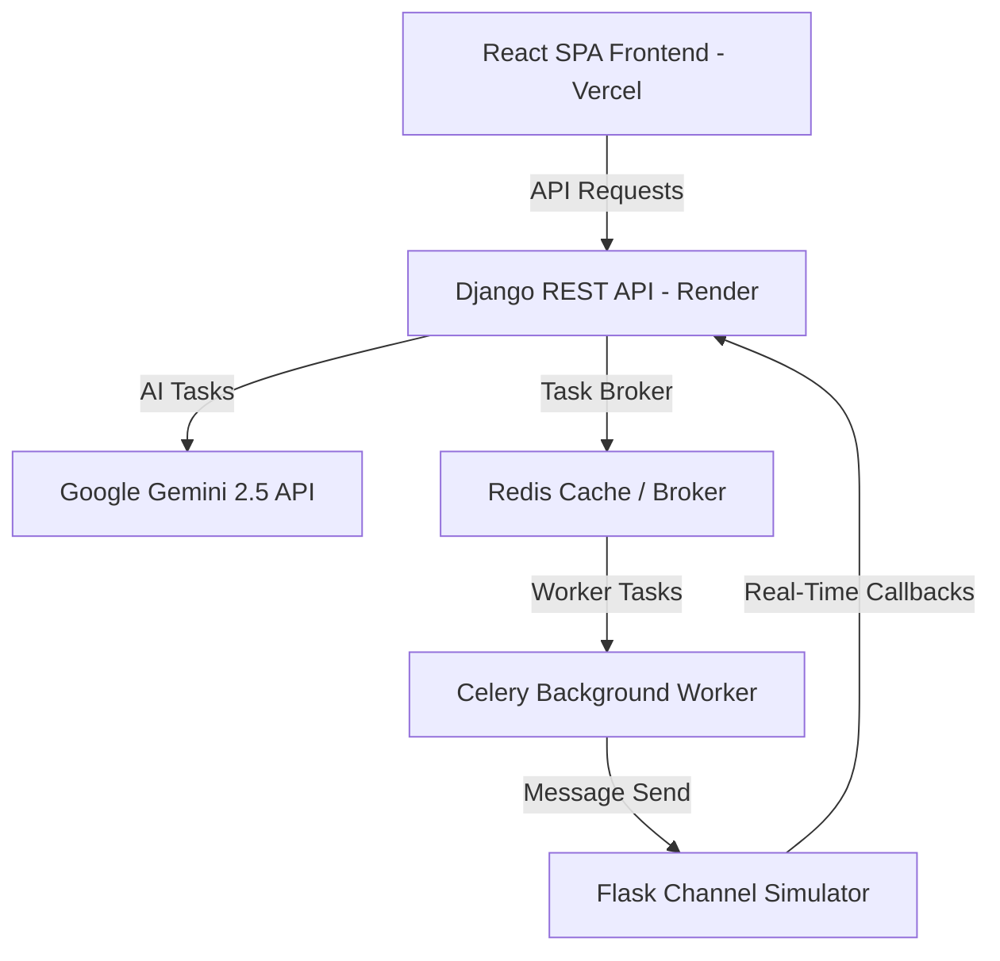

# Xeno CRM — E2E AI-Driven Marketing Automation Platform

Xeno CRM is an advanced, production-ready marketing automation platform built to demonstrate agentic AI workflow integration in a modern customer database. It allows marketers to build audience segments, draft personalized copy, launch campaigns, and track performance funnels in real-time.

---

## 🌟 Architecture & Tech Stack

The platform is designed with a decoupled architecture, optimized for scalability, offline development, and high-performance cloud deployment.



* **Frontend:** Single Page Application (SPA) built using **React 18**, **Vite**, and styled with custom **Vanilla CSS Glassmorphism**. (Deployed on **Vercel**).
* **Backend:** **Django REST Framework (DRF)** providing secure JSON REST APIs. (Deployed on **Render**).
* **AI Agent:** Google Gemini (`gemini-2.5-flash`) powered by **LangChain** with tool calling and conversational history. Supports fallback to offline local models (e.g., Ollama `Qwen3` / `Llama3`).
* **Task Queue:** **Celery** with **Redis** as a message broker to execute bulk messaging asynchronous jobs.
* **Delivery Simulator:** **Flask** microservice simulating communication network statuses (`sent` ➔ `delivered` ➔ `read` ➔ `clicked` ➔ `ordered`) with rate-limited callbacks back to Django.
* **Database:** **SQLite** (local development) / **PostgreSQL** (production ready via `dj-database-url`).

---

## 🚀 Key Features

1. **Agentic Conversational Chat:** Chat with a Gemini-powered marketing assistant that can automatically invoke backend tools, construct SQL-equivalent query segment rules, write tailored SMS/WhatsApp copies, and schedule campaigns.
2. **Dynamic Live Campaign Funnel:** Launch campaigns and view real-time delivery funnels. A visual callback simulator lets you simulate delivery ticks and watch stats animate in real-time.
3. **Interactive Customer Directory:** Paginated grid to inspect customer spent, city, order counts, and registration records with dynamic filtering.
4. **Saved Segments Explorer:** View rules, natural language queries, and audience counts of all automatically created segments.
5. **Robust Concurrency Safe Queue:** Uses a thread-safe callback worker in the channel service with a 15ms pace delay to guarantee database write integrity on SQLite, preventing concurrent database lock conflicts.

---

## 🔁 End-to-End Execution Walkthrough

Here is the exact step-by-step flow of how a marketer uses the platform:

### Step 1: Speak to the Agent (Chat)
A marketer opens the dashboard and types:
> *"Find me all customers from Mumbai who have spent more than 5000 rupees."*

* **Backend Action:** The Gemini agent invokes the `segment_customers` tool. It generates the filter structure:
  ```json
  {"operator": "AND", "rules": [{"field": "city", "operator": "eq", "value": "Mumbai"}, {"field": "total_spent", "operator": "gt", "value": 5000}]}
  ```
* **Frontend Response:** The UI intercepts the tool output and displays a **Sample Preview Table** of the matching customers directly in the chat workspace.

### Step 2: Draft the Message
The marketer types:
> *"Write a WhatsApp message for them about a Monsoon Sale with 20% off."*

* **Backend Action:** The agent invokes `draft_message`. It queries Gemini to draft Indian-branded copy, including a custom `{name}` template placeholder, rupee symbols (`₹`), and monsoon emojis.
* **Frontend Response:** The UI displays a live smartphone mockup showing exactly how the WhatsApp message bubble will look to the recipient.

### Step 3: Create the Campaign
The marketer types:
> *"Create a campaign called 'Mumbai Monsoon Sale' with this message on WhatsApp."*

* **Backend Action:** The agent calls `create_campaign`. It persists the Segment (containing the natural query and filters) and a Campaign record (status: `draft`) to the Django database.

### Step 4: Fire the Campaign
The marketer clicks the **Fire Campaign** button in the UI (or executes POST `/api/campaigns/{id}/fire/`).
* **Backend Action:** Django triggers a Celery task. The Celery worker retrieves segment customers, personalized copies (replacing `{name}` with the customer's first name), creates a `pending` log, and dispatches them to the Flask Channel Simulator.

### Step 5: Simulate Live Deliveries
The marketer selects the campaign and launches the **Callback Console** in the dashboard.
* **Simulation Action:** Clicking ticks triggers the Flask simulator to step through states. Flask pushes sequential POST request status updates to `/api/receipts/`.
* **Frontend Response:** The delivery funnel rates (Sent, Delivered, Read, Clicked, Ordered) update and animate dynamically on your dashboard charts.

---

## 🛠️ Local Development Setup

To run the entire suite locally:

### 1. Run the Backend (Django + Celery + Channel Service)
Ensure you have a local Redis server running on `redis://localhost:6379/0`.

```bash
# Navigate to backend root
cd xeno-crm

# Setup virtual environment
python3 -m venv venv
source venv/bin/activate
pip install -r requirements.txt

# Create .env file with your variables
cp .env.example .env

# Run migrations and collect static assets
python manage.py migrate
python manage.py collectstatic --noinput

# Launch servers (in separate terminal sessions)
python manage.py runserver               # Django on port 8000
celery -A xeno_crm worker --loglevel=info # Celery Worker
python channel_service/app.py            # Channel Service on port 5001
```

### 2. Run the Frontend (React Vite)
```bash
cd mini-CRM-frontend/frontend
npm install
npm run dev                             # Runs Vite on http://localhost:5173
```

---

## 🚀 Production Deployment Specs

The codebase is hardened and pre-configured for production environments:

### Vercel (Frontend SPA)
* **API base routing:** The frontend uses relative API base paths (`import.meta.env.VITE_API_BASE`).
* **Client-side Routing:** The included `vercel.json` rewrites all paths to `index.html`, ensuring React Router navigation (e.g. `/segments`) works seamlessly on refresh.
* **Required Env Vars:** Set `VITE_API_BASE=https://your-backend-url.onrender.com` in Vercel settings.

### Render (Unified Backend Services)
To deploy the entire backend stack for **100% free** under Render's Free tier:
1. Create a **Key Value (Redis)** instance on Render and copy the *Internal Connection URL*.
2. Create a **Web Service**, linking your Django repository.
3. Configure the following Render settings:
   * **Root Directory:** `xeno-crm`
   * **Start Command:**
     ```bash
     celery -A xeno_crm worker --loglevel=info & python channel_service/app.py & gunicorn xeno_crm.wsgi:application --bind 0.0.0.0:$PORT
     ```
   * **Environment Variables:**
     * `PYTHON_VERSION=3.10` *(avoids pre-release Python compilation issues)*
     * `REDIS_URL` = *[Your Internal Redis URL]*
     * `GOOGLE_API_KEY` = *[Your Gemini API Key]*
     * `USE_LOCAL_LLM` = `False`
     * `ALLOWED_HOSTS` = `localhost,127.0.0.1,your-render-domain.onrender.com`
     * `CORS_ALLOWED_ORIGINS` = `https://your-vercel-domain.vercel.app`
     * `CHANNEL_SERVICE_URL` = `http://localhost:5001`
     * `CRM_BASE_URL` = `https://your-render-domain.onrender.com`
